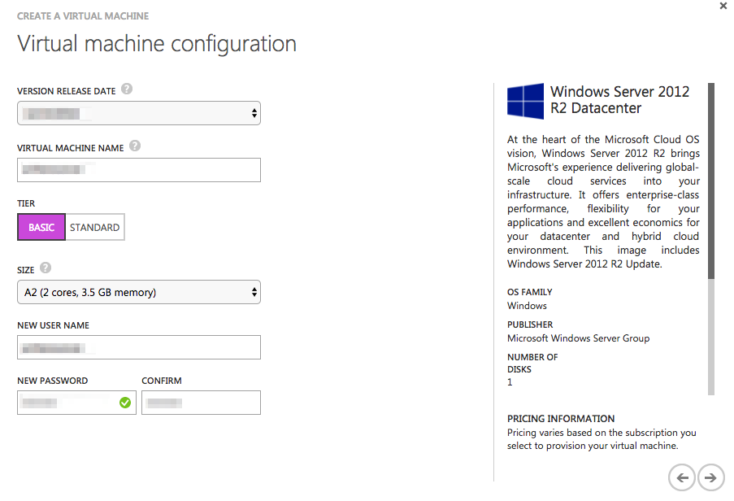
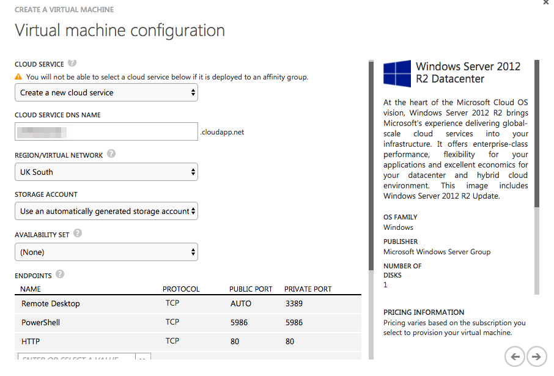
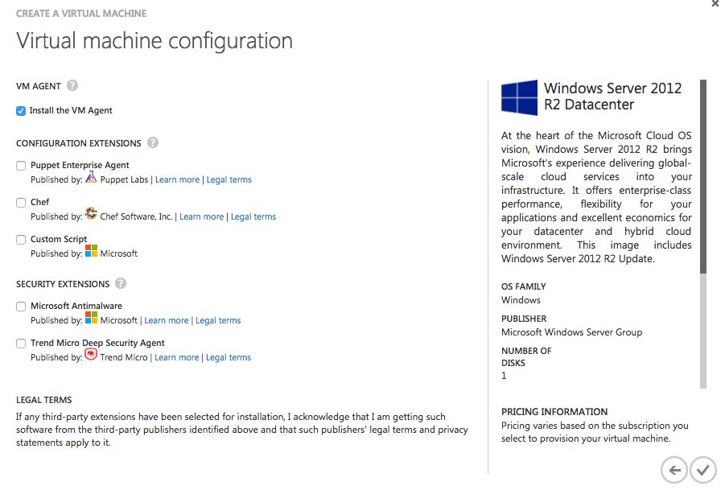

# Azure Web Apps Real-time Antivirus Concept

**Repository objective:** 
To provide affordable real-time malware upload/download scanning concept that requires no changes to be made to your application.


## Setup Instructions

### Step 1 - Create and Setup Azure VM

VM size and tier doesn't really matter at this stage (this is a proof of concept)



Enable HTTP port (this is a proof of concept)



Make sure "Install VM Agent" checkbox is ticked



Now that VM is up and running, RDP onto it and do the following: 

Install Symantec, [follow manual instructions & run the script](https://github.com/zkavtaskin/Azure-Web-Apps-Antivirus/blob/master/AVFileReceiver/PowerShell/InstallSymantec.ps1) 

Install web server, [run the script](https://github.com/zkavtaskin/Azure-Web-Apps-Antivirus/blob/master/AVFileReceiver/PowerShell/InstallSymantec.ps1)


### Step 2 - Download and build this project

### Step 3 - Publish AVFileReceiver onto the Azure VM

### Step 4 - Configure AppExample

Update the following values in the AppExample:
```
<appSettings>
    <add key="AVFilterIIS.Folder.TempUpload" value="C:\your\path\" />
    <add key="AVFilterIIS.FileReceiverAPIURL" value="http://yourcloudservice.cloudapp.net/api/Receiver/"/>
<appSettings>
```

### Step 5 - Run AppExample
